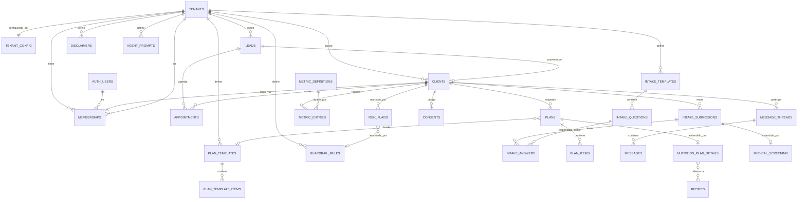

# ADR-0001 — Arquitectura núcleo y modelo de datos

> Estado: **PROPUESTA (en revisión)** · Fecha: 2026-06-18 · Reemplaza: — · Relacionado: PLAN_DEL_PROYECTO.es.md
> *(Copia en español para lectura. La versión oficial del repo es la inglesa: `0001-core-architecture-and-data-model.md`.)*

## Contexto

Construimos una plataforma SaaS de coaching multi-tenant, lanzando con un solo tenant (Sebastián Barrón — SB My Weight Compass). Los no negociables: tenant en cada entidad del core con RLS, reglas del profesional como datos, bilingüe desde el esquema, privacidad por diseño para datos de salud en AU, humano en el loop en todo lo clínico-adyacente, y una costura dura entre un core genérico y los módulos verticales (nutrición). Esta ADR fija las decisiones fundacionales y el modelo de datos del **núcleo**. El módulo de nutrición se bosqueja solo para mostrar la costura; su modelo completo es una ADR posterior.

Esta ADR debe aprobarse antes de aplicar cualquier esquema.

---

## Decisiones

### D1 — Multi-tenancy: esquema compartido + `tenant_id` + RLS
Una sola base de datos Postgres, tablas compartidas, una columna `tenant_id` (UUID) en cada fila del core, aislamiento aplicado por **Row-Level Security**. Rechazado: esquema-por-tenant y db-por-tenant (operacionalmente pesados, prematuros para un solo tenant activo, migraciones más difíciles). Las políticas RLS se escriben una vez como dos intenciones: *"la fila pertenece al tenant del profesional que solicita"* y *"un cliente solo puede leer/escribir lo suyo"*. Sebastián se siembra como `tenant #1`.

### D2 — Identidad: un solo pool de auth, rol vía membership
Un solo pool `auth.users` de Supabase. Una fila `memberships` vincula un `user` con un `tenant` y un `role` (`owner` / `professional` / `staff` / `client`). Un `client` es un `member` con rol `client`, ligado 1:1 a un registro `clients`. **Los leads no son usuarios de auth** — existen sin login hasta convertirse e invitarse (D3). El tenant actual se resuelve desde el membership; RLS lee `tenant_id` desde el JWT/`memberships`.

### D3 — Ciclo lead → cliente (gated: el coach invita tras la consulta)
Una máquina de estados deliberada, acorde al modelo elegido:

```
lead (sin login)  →  consulta_agendada  →  consulta_realizada
      →  [el coach convierte]  →  cliente_invitado  →  cliente_activo
      →  pausado / archivado
```

`leads` capturan contactos del embudo de marketing (sitio público + agenda Cal.com). Tras la consulta gratuita, el coach **convierte** un lead: esto crea una fila `clients`, emite una invitación, y al aceptarse aprovisiona el `auth.users` + `memberships(role=client)`. El onboarding/intake se dispara en la conversión. Esto mantiene el embudo de marketing y los clientes de pago claramente separados, y da un rastro de consentimiento limpio.

### D4 — i18n: catálogos de UI + JSONB localizado para contenido
Strings de UI vía catálogos de mensajes de `next-intl` (`en`, `es`). Los campos de **contenido** traducibles (títulos de plan, texto de preguntas de intake, disclaimers, copy de marketing) se guardan como mapas JSONB localizados, p. ej. `{ "en": "...", "es": "..." }`, resueltos por un helper en la lectura. Rechazado para v1: tablas de traducción por fila (más joins, prematuro para dos idiomas). Se revisa si crece el número de idiomas o si los flujos de traducción necesitan versionado.

### D5 — Reglas del profesional como datos (config-as-data)
Ningún comportamiento específico del tenant está hardcodeado. Tablas de config tipadas lo contienen:
`tenant_config` (branding, idioma por defecto, scope), `intake_templates` + `intake_questions`, `plan_templates` + `plan_template_items`, `agent_prompts`, `disclaimers`, `guardrail_rules`. Todas llevan `tenant_id`. Los datos semilla de SB viven en migraciones de seed versionadas. Un segundo tenant necesita config + seed, no un fork.

### D6 — Scheduling: Cal.com detrás de una abstracción de proveedor
Cal.com es el motor de agenda para la consulta gratuita. Mantenemos nuestro propio espejo `appointments` con clave en el id de booking de Cal.com, sincronizado vía webhook → Edge Function de Supabase. Una interfaz `SchedulingProvider` aísla a Cal.com para que un booking nativo (u otro proveedor por tenant) pueda reemplazarlo después sin tocar el modelo del core.

### D7 — Costura core / vertical: esquemas Postgres separados
El core vive en el esquema **`core`**; la vertical de nutrición vive en **`nutrition`**. Regla dura: **`nutrition` puede referenciar a `core`, nunca al revés.** Esto hace la costura estructural, no solo una convención de nombres, y evita que una segunda vertical (o un tenant no-nutricional) herede tablas de nutrición. Tradeoff a confirmar: la exposición de esquemas en PostgREST y RLS debe configurarse por esquema (anotado como punto abierto O3).

### D8 — Privacidad, consentimiento y auditoría (datos de salud AU)
Proyecto Supabase en **Sídney** por residencia. `consents` es versionado y por propósito (intake, procesamiento de datos de salud, marketing, procesamiento asistido por IA), con historial append-only. `audit_log` es append-only para lecturas/escrituras sensibles. Las columnas de salud sensibles se cifran en reposo (Supabase/Postgres) con cifrado a nivel de columna para los campos más sensibles (screening médico); el acceso es RLS-gated y auditado. Los flujos de **export** y **borrado** del sujeto de datos son de primera clase (soft-delete + hard-erase programado). Alineado con el Privacy Act federal y el Health Records Act de Victoria.

### D9 — "Coaching, no clínico": el semáforo como concern del core
Un modelo transversal `risk_flags` lleva un estado verde/ámbar/rojo sobre un cliente y sobre las acciones propuestas por los agentes. `guardrail_rules` (config, aportada por el módulo de nutrición) define los gatillos — condiciones médicas, medicación, lenguaje de trastorno alimentario. El checklist de condiciones médicas del intake es **screening activo**: una respuesta positiva levanta una bandera `gp_clearance` (ámbar/rojo) que bloquea la entrega del plan hasta que se obtenga el clearance. Los agentes nunca emiten consejo clínico; ante un gatillo **escalan** (crean una bandera + rutean al humano). Disclaimers y copy de derivación son config (D5) y se renderizan de forma visible.

---

## Modelo de datos del núcleo

### Diagrama entidad-relación (core, con la costura de nutrición mostrada)



### Tablas del núcleo (esquema `core`)

Cada tabla de abajo lleva `tenant_id uuid not null`, `created_at`, `updated_at`, y (cuando contiene datos personales) soft-delete `deleted_at`.

| Tabla | Propósito | Columnas clave | Intención RLS |
|---|---|---|---|
| `tenants` | El profesional/negocio | `id`, `name`, `slug`, `status`, `default_locale`, `region` | Legible por sus miembros; escritura por `owner`. |
| `tenant_config` | Branding, scope, idioma, flags (como datos) | `tenant_id`, `branding jsonb`, `scope jsonb`, `feature_flags jsonb` | Miembros leen; `owner`/`professional` escriben. |
| `memberships` | Vincula user→tenant→rol | `user_id`, `tenant_id`, `role`, `status` | Usuario lee el suyo; `owner` gestiona los del tenant. |
| `leads` | Contactos del embudo (sin login) | `tenant_id`, `name`, `email`, `locale`, `source`, `status`, `notes` | Solo profesionales del tenant. |
| `clients` | Registro de cliente de pago/activo | `tenant_id`, `lead_id`, `membership_id`, `status`, `display_name`, `locale`, `risk_state` | Profesionales (tenant) + el propio cliente (su fila). |
| `appointments` | Espejo de la consulta en Cal.com | `tenant_id`, `lead_id`/`client_id`, `provider`, `provider_booking_id`, `starts_at`, `status` | Profesionales; el cliente ve la suya. |
| `intake_templates` | Formulario de intake/onboarding configurable | `tenant_id`, `key`, `title jsonb`, `version`, `active` | Profesionales gestionan; clientes leen el asignado. |
| `intake_questions` | Preguntas de una plantilla | `template_id`, `tenant_id`, `code`, `prompt jsonb`, `type`, `options jsonb`, `is_screening`, `order` | Igual que la plantilla. |
| `intake_submissions` | El intake llenado de un cliente | `tenant_id`, `client_id`, `template_id`, `status`, `submitted_at` | Profesionales + el cliente dueño. |
| `intake_answers` | Respuestas dentro de un envío | `submission_id`, `question_id`, `tenant_id`, `value jsonb` | Profesionales + el cliente dueño. |
| `plan_templates` / `plan_template_items` | Plantillas de plan reutilizables | `tenant_id`, `title jsonb`, `kind`, items `order`, `body jsonb` | Profesionales (tenant). |
| `plans` | Un plan asignado a un cliente | `tenant_id`, `client_id`, `template_id?`, `kind`, `status`, `approved_by`, `approved_at` | Profesionales + cliente dueño (lectura). |
| `plan_items` | Ítems dentro de un plan | `plan_id`, `tenant_id`, `order`, `body jsonb` | Profesionales + cliente dueño (lectura). |
| `metric_definitions` | Qué se puede seguir (genérico) | `tenant_id`, `code`, `label jsonb`, `unit`, `value_type` | Profesionales gestionan; clientes leen. |
| `metric_entries` | Un valor seguido en el tiempo | `tenant_id`, `client_id`, `metric_def_id`, `value`, `recorded_at`, `source` | Profesionales + cliente dueño. |
| `message_threads` | Conversación cliente↔profesional | `tenant_id`, `client_id`, `subject`, `status` | Profesionales + cliente dueño. |
| `messages` | Un mensaje, posiblemente borrador de IA | `thread_id`, `tenant_id`, `sender_type`, `body`, `ai_draft`, `approved_by`, `status` | Profesionales + cliente dueño. |
| `consents` | Consentimiento versionado, por propósito | `tenant_id`, `client_id`, `purpose`, `version`, `granted`, `granted_at` | Profesionales (lectura) + cliente dueño. |
| `risk_flags` | Estado del semáforo + escaladas | `tenant_id`, `client_id`, `level`, `category`, `rule_id?`, `status`, `resolved_by` | Profesionales; el cliente ve un subconjunto limitado. |
| `guardrail_rules` | Reglas de gatillo (config) | `tenant_id`, `category`, `pattern`, `default_level`, `action` | Profesionales gestionan. |
| `agent_prompts` | Config de prompt por agente | `tenant_id`, `agent_key`, `prompt jsonb`, `version` | Profesionales gestionan. |
| `disclaimers` | Copy legal/de alcance visible (config) | `tenant_id`, `key`, `body jsonb`, `placement` | Profesionales gestionan; lectura pública donde se coloque. |
| `audit_log` | Log append-only de acceso sensible | `tenant_id`, `actor`, `action`, `entity`, `entity_id`, `at` | Solo insert; lectura por `owner`. |

### Módulo de nutrición (esquema `nutrition`) — solo la costura, modelo completo después
`nutrition_plan_details` (extiende `core.plans`), `recipes`, `food_items` (AUSNUT), `medical_screening` (extiende `core.intake_submissions`, dispara `gp_clearance`), `exercise_plans`, `wearable_connections` + `wearable_metrics` (mapean a `core.metric_entries`). Estos **referencian** a `core`, nunca al revés.

---

## Consecuencias

**Positivas:** un único camino de migración; aislamiento demostrable vía tests de RLS; un segundo tenant necesita config + seed, no código nuevo; el core no tiene conocimiento de nutrición; los controles de privacidad son estructurales; Cal.com nos lleva al valor de la Fase 1 rápido sin dejar de ser reemplazable.

**Costos / riesgos:** la corrección de RLS pasa a ser crítica para la seguridad — necesita una suite dedicada de tests de políticas. La exposición de dos esquemas añade config de PostgREST/RLS (O3). El JSONB localizado empuja algo de validación a la capa de aplicación. La sincronización por webhook de Cal.com necesita idempotencia + reconciliación.

---

## Puntos abiertos para tu visto bueno

- **O1 — Nombre.** Nombre de trabajo de la plataforma "Compass" y nombre del repo en GitHub (propuesta: `compass-platform`). ¿OK, o prefieres otro?
- **O2 — Roles.** ¿`owner / professional / staff / client` son los roles iniciales correctos, o `staff` es prematuro por ahora?
- **O3 — Costura de esquemas.** Confirmar esquemas Postgres `core` / `nutrition` separados (D7) vs un solo esquema `public` con nombres `core_*` / `nut_*`. Recomiendo esquemas separados; es el único punto con un tradeoff operativo real.
- **O4 — Generalidad de métricas.** ¿Basta el par genérico `metric_definitions` + `metric_entries` para peso/medidas/wearables, o quieres métricas tipadas más ricas en el core ahora?
- **O5 — Granularidad del consentimiento.** Confirmar los propósitos de consentimiento: intake, procesamiento de datos de salud, marketing, procesamiento asistido por IA. ¿Agregar/quitar alguno?
