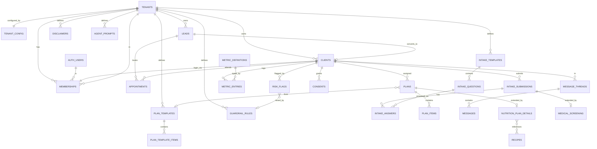

# ADR-0001 — Core architecture & data model

> Status: **PROPOSED (awaiting review)** · Date: 2026-06-18 · Supersedes: — · Related: PROJECT_PLAN.md

## Context

We are building a multi-tenant SaaS coaching platform, launching with a single tenant (Sebastián Barrón — SB My Weight Compass). The non-negotiables: tenant on every core entity with RLS, professional rules as data, bilingual from the schema, privacy-by-design for AU health data, human-in-the-loop on anything clinical-adjacent, and a hard seam between a generic core and vertical (nutrition) modules. This ADR fixes the foundational decisions and the **core** data model. The nutrition module is sketched only to show the seam; its full model is a later ADR.

This ADR must be approved before any schema is applied.

---

## Decisions

### D1 — Multi-tenancy: shared schema + `tenant_id` + RLS
One Postgres database, shared tables, a `tenant_id` (UUID) column on every core row, isolation enforced by **Row-Level Security**. Rejected: schema-per-tenant and db-per-tenant (operationally heavy, premature for one active tenant, harder migrations). RLS policies are written once as two intents: *"row belongs to the requesting professional's tenant"* and *"a client may read/write only their own rows."* Sebastián is seeded as `tenant #1`.

### D2 — Identity: one auth pool, role via membership
A single Supabase `auth.users` pool. A `memberships` row binds a `user` to a `tenant` with a `role` (`owner` / `professional` / `staff` / `client`). A `client` is a `member` with role `client`, linked 1:1 to a `clients` record. **Leads are not auth users** — they exist without a login until converted and invited (D3). The current tenant is resolved from the membership; RLS reads `tenant_id` from the JWT/`memberships`.

### D3 — Lead → client lifecycle (gated: coach invites after consult)
A deliberate state machine, matching the chosen model:

```
lead (no login)  →  consult_booked  →  consult_done
      →  [coach converts]  →  client_invited  →  client_active
      →  paused / archived
```

`leads` capture marketing-funnel contacts (public site + Cal.com booking). After the free consult, the coach **converts** a lead: this creates a `clients` row, issues an invite, and on acceptance provisions the `auth.users` + `memberships(role=client)`. Onboarding/intake is triggered at conversion. This keeps the marketing funnel and paid clients cleanly separated and gives a clean consent trail.

### D4 — i18n: UI catalogs + localized JSONB for content
UI strings via `next-intl` message catalogs (`en`, `es`). Translatable **content** fields (plan titles, intake question text, disclaimers, marketing copy) are stored as localized JSONB maps, e.g. `{ "en": "...", "es": "..." }`, resolved by a helper at read time. Rejected for v1: per-row translation tables (more joins, premature for two locales). Revisit if locale count grows or translation workflows need versioning.

### D5 — Professional rules as data (config-as-data)
No tenant-specific behaviour is hardcoded. Typed config tables hold it:
`tenant_config` (branding, locale defaults, scope), `intake_templates` + `intake_questions`, `plan_templates` + `plan_template_items`, `agent_prompts`, `disclaimers`, `guardrail_rules`. All carry `tenant_id`. Seed data for SB lives in versioned seed migrations. A second tenant is a config exercise, not a fork.

### D6 — Scheduling: Cal.com behind a provider abstraction
Cal.com is the booking engine for the free consult. We keep our own `appointments` mirror keyed by the Cal.com booking id, kept in sync via webhook → Supabase Edge Function. A `SchedulingProvider` interface isolates Cal.com so native in-app booking (or another provider per tenant) can replace it later without touching the core model.

### D7 — Core / vertical seam: separate Postgres schemas
Core lives in schema **`core`**; the nutrition vertical lives in **`nutrition`**. Hard rule: **`nutrition` may reference `core`, never the reverse.** This makes the seam structural, not just a naming convention, and keeps a second vertical (or a non-nutrition tenant) from inheriting nutrition tables. Tradeoff to confirm: PostgREST schema exposure and RLS must be configured per schema (noted as open item O3).

### D8 — Privacy, consent & audit (AU health data)
Supabase project in **Sydney** for residency. `consents` is versioned and per-purpose (intake, health-data processing, marketing, AI-assisted processing), append-only history. `audit_log` is append-only for sensitive reads/writes. Health-sensitive columns are encrypted at rest (Supabase/Postgres) with column-level encryption for the most sensitive fields (medical screening); access is RLS-gated and audited. Data-subject **export** and **erase** workflows are first-class (soft-delete + scheduled hard-erase). Aligns with the federal Privacy Act and Victoria's Health Records Act.

### D9 — "Coaching, not clinical" traffic-light as a core concern
A cross-cutting `risk_flags` model carries a green/amber/red state on a client and on agent-proposed actions. `guardrail_rules` (config, supplied by the nutrition module) defines triggers — medical conditions, medication, eating-disorder language. The intake medical-conditions checklist is **active screening**: a positive answer raises a `gp_clearance` flag (amber/red) that blocks plan delivery until cleared. Agents never emit clinical advice; on a trigger they **escalate** (create a flag + route to the human). Disclaimers and referral copy are config (D5) and rendered visibly.

---

## Core data model

### Entity-relationship (core, with the nutrition seam shown)



### Core tables (schema `core`)

Every table below carries `tenant_id uuid not null`, `created_at`, `updated_at`, and (where it holds personal data) soft-delete `deleted_at`.

| Table | Purpose | Key columns | RLS intent |
|---|---|---|---|
| `tenants` | The professional/business | `id`, `name`, `slug`, `status`, `default_locale`, `region` | Readable by its members; writes by `owner`. |
| `tenant_config` | Branding, scope, locale, flags (as data) | `tenant_id`, `branding jsonb`, `scope jsonb`, `feature_flags jsonb` | Members read; `owner`/`professional` write. |
| `memberships` | Binds user→tenant→role | `user_id`, `tenant_id`, `role`, `status` | User reads own; `owner` manages tenant's. |
| `leads` | Marketing-funnel contacts (no login) | `tenant_id`, `name`, `email`, `locale`, `source`, `status`, `notes` | Tenant professionals only. |
| `clients` | Paid/active client record | `tenant_id`, `lead_id`, `membership_id`, `status`, `display_name`, `locale`, `risk_state` | Professionals (tenant) + the client themselves (own row). |
| `appointments` | Consult mirror of Cal.com | `tenant_id`, `lead_id`/`client_id`, `provider`, `provider_booking_id`, `starts_at`, `status` | Professionals; client sees own. |
| `intake_templates` | Configurable intake/onboarding form | `tenant_id`, `key`, `title jsonb`, `version`, `active` | Professionals manage; clients read assigned. |
| `intake_questions` | Questions of a template | `template_id`, `tenant_id`, `code`, `prompt jsonb`, `type`, `options jsonb`, `is_screening`, `order` | Same as template. |
| `intake_submissions` | A client's filled intake | `tenant_id`, `client_id`, `template_id`, `status`, `submitted_at` | Professionals + owning client. |
| `intake_answers` | Answers within a submission | `submission_id`, `question_id`, `tenant_id`, `value jsonb` | Professionals + owning client. |
| `plan_templates` / `plan_template_items` | Reusable plan blueprints | `tenant_id`, `title jsonb`, `kind`, items `order`, `body jsonb` | Professionals (tenant). |
| `plans` | A plan assigned to a client | `tenant_id`, `client_id`, `template_id?`, `kind`, `status`, `approved_by`, `approved_at` | Professionals + owning client (read). |
| `plan_items` | Items within a plan | `plan_id`, `tenant_id`, `order`, `body jsonb` | Professionals + owning client (read). |
| `metric_definitions` | What can be tracked (generic) | `tenant_id`, `code`, `label jsonb`, `unit`, `value_type` | Professionals manage; clients read. |
| `metric_entries` | A tracked value over time | `tenant_id`, `client_id`, `metric_def_id`, `value`, `recorded_at`, `source` | Professionals + owning client. |
| `message_threads` | Client↔professional conversation | `tenant_id`, `client_id`, `subject`, `status` | Professionals + owning client. |
| `messages` | A message, possibly AI-drafted | `thread_id`, `tenant_id`, `sender_type`, `body`, `ai_draft`, `approved_by`, `status` | Professionals + owning client. |
| `consents` | Versioned, per-purpose consent | `tenant_id`, `client_id`, `purpose`, `version`, `granted`, `granted_at` | Professionals (read) + owning client. |
| `risk_flags` | Traffic-light state + escalations | `tenant_id`, `client_id`, `level`, `category`, `rule_id?`, `status`, `resolved_by` | Professionals; client sees limited subset. |
| `guardrail_rules` | Trigger rules (config) | `tenant_id`, `category`, `pattern`, `default_level`, `action` | Professionals manage. |
| `agent_prompts` | Per-agent prompt config | `tenant_id`, `agent_key`, `prompt jsonb`, `version` | Professionals manage. |
| `disclaimers` | Visible legal/scope copy (config) | `tenant_id`, `key`, `body jsonb`, `placement` | Professionals manage; public read where placed. |
| `audit_log` | Append-only sensitive-access log | `tenant_id`, `actor`, `action`, `entity`, `entity_id`, `at` | Insert-only; `owner` read. |

### Nutrition module (schema `nutrition`) — seam only, full model later
`nutrition_plan_details` (extends `core.plans`), `recipes`, `food_items` (AUSNUT), `medical_screening` (extends `core.intake_submissions`, drives `gp_clearance`), `exercise_plans`, `wearable_connections` + `wearable_metrics` (map into `core.metric_entries`). These **reference** `core`, never the reverse.

---

## Consequences

**Positive:** one migration path; isolation provable via RLS tests; a second tenant needs config + seed, not new code; the core has no nutrition knowledge; privacy controls are structural; Cal.com gets us to Phase 1 value fast while staying swappable.

**Costs / risks:** RLS correctness is now safety-critical — needs a dedicated policy test suite. Two-schema exposure adds PostgREST/RLS config (O3). Localized JSONB pushes some validation into the app layer. Cal.com webhook sync needs idempotency + reconciliation.

---

## Open items for your sign-off

- **O1 — Naming.** Platform working name "Compass" and GitHub repo name (proposal: `compass-platform`). OK, or your preference?
- **O2 — Roles.** Are `owner / professional / staff / client` the right starter roles, or is `staff` premature for now?
- **O3 — Schema seam.** Confirm separate `core` / `nutrition` Postgres schemas (D7) vs a single `public` schema with `core_*` / `nut_*` naming. I recommend separate schemas; it's the only point with a real operational tradeoff.
- **O4 — Metrics generality.** Is a generic `metric_definitions` + `metric_entries` pair enough for weight/measurements/wearables, or do you want richer typed metrics in the core now?
- **O5 — Consent granularity.** Confirm the consent purposes: intake, health-data processing, marketing, AI-assisted processing. Add/remove any?
